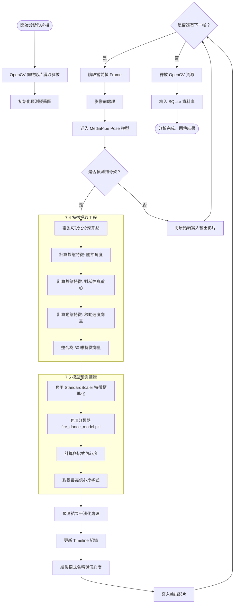

```mermaid

flowchart TD
    Start([開始分析影片檔]) --> OpenVid[OpenCV 開啟影片獲取參數]
    OpenVid --> InitBuffer[初始化預測緩衝區]
    
    LoopStart{"是否還有下一幀？"} -->|是| ReadFrame[讀取當前幀 Frame]
    ReadFrame --> Preprocess[影像前處理]
    Preprocess --> MPPose[送入 MediaPipe Pose 模型]
    MPPose --> DetectLandmarks{"是否偵測到骨架？"}
    
    DetectLandmarks -->|否| WriteRaw[將原始幀寫入輸出影片]
    DetectLandmarks -->|是| DrawMP[繪製可視化骨架節點]
    
    subgraph FeatureEngineering ["7.4 特徵提取工程"]
        DrawMP --> CalcAngle[計算靜態特徵: 關節角度]
        CalcAngle --> CalcSymm[計算靜態特徵: 對稱性與重心]
        CalcSymm --> CalcVel[計算動態特徵: 移動速度向量]
        CalcVel --> FormVector[整合為 30 維特徵向量]
    end
    
    subgraph Prediction ["7.5 模型預測邏輯"]
        FormVector --> Norm[套用 StandardScaler 特徵標準化]
        Norm --> PredictML[套用分類器 fire_dance_model.pkl]
        PredictML --> GetProbs[計算各招式信心度]
        GetProbs --> MaxProb[取得最高信心度招式]
    end
    
    MaxProb --> Smooth[預測結果平滑化處理]
    Smooth --> UpdateTimeline[更新 Timeline 紀錄]
    UpdateTimeline --> DrawText[繪製招式名稱與信心度]
    DrawText --> WriteProcessed[寫入輸出影片]
    
    WriteProcessed --> LoopStart
    WriteRaw --> LoopStart
    
    LoopStart -->|否| CapRelease[釋放 OpenCV 資源]
    CapRelease --> SaveDB[寫入 SQLite 資料庫]
    SaveDB --> End([分析完成，回傳結果])
```
